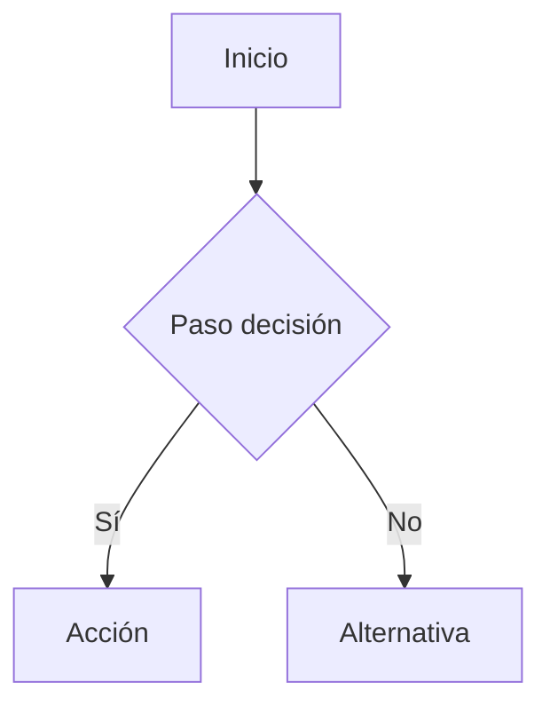

# Flujos UX/UI

Directorio de flujos de experiencia de usuario del proyecto **Portafolio de Clientes** (CRM personal).

Los flujos se documentan con **diagramas Mermaid** (flowchart o sequence) en markdown, versionables y renderizables en GitHub.

## Índice de flujos

| Flujo | Descripción | HUs relacionadas | Estado |
|-------|-------------|------------------|--------|
| `rubro-crud.md` | CRUD completo de rubros (crear, editar, desactivar, eliminar, fork) | HU-013, HU-014, HU-015, HU-016 | Aprobado |
| `categoria-crud.md` | CRUD completo de categorías (crear, editar, desactivar, eliminar, fork) | HU-017, HU-018, HU-019, HU-020 | Aprobado |
| `servicio-crud.md` | CRUD completo de servicios (crear, editar, mover categoría, desactivar/eliminar según historial, fork) | HU-021, HU-022, HU-023 | Aprobado |
| `rubro-categoria-servicio-lifecycle.md` | Ciclo de vida desactivar/eliminar/reactivar con cascada y matriz de visibilidad | HU-015, HU-016, HU-019, HU-020, HU-023 | Aprobado |
| `catalogo-personalizacion.md` | Fork/personalización de catálogo (seleccionar, override, crear personal, herencia dinámica) | HU-025 (principal) | Aprobado |
| `seeders-catalogo.md` | Carga inicial de catálogo base (rubros, categorías, servicios con valores ficticios) | HU-024 | Aprobado |

## Convenciones

- Un archivo por flujo, nombre descriptivo en kebab-case: `auth-flow.md`, `cliente-flow.md`.
- Priorizar `flowchart TD` para navegación/estados y `sequenceDiagram` para interacciones con backend.
- Cada flujo lista: diagrama, pasos, pantallas involucradas, casos edge/errores y HUs relacionadas.
- Un flujo transversal (ej: auth) vive acá; un flujo exclusivo de una HU puede vivir dentro de la HU.
- Actualizar el índice al agregar/modificar un flujo.

## Template de flujo

```markdown
# Nombre del flujo

**HUs relacionadas:** HU-XXX, HU-YYY
**Estado:** Borrador | Revisado | Aprobado

## Diagrama



## Pasos

1. Paso 1
2. Paso 2

## Pantallas involucradas

- `/ruta` — descripción

## Casos edge / errores

- Sin datos: ...
- Error de red: ...
```