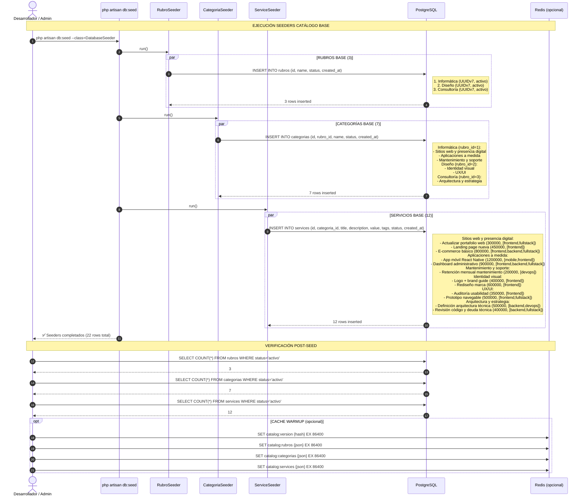

# Flujo: Seeders Catálogo Base (Carga Inicial)

**Épica:** Rubros, categorías y servicios
**HU principal:** HU-024
**Fecha:** 2026-08-28

---

## Diagrama Mermaid



---

## Diagrama de Flujo (Alternativa Visual)

```mermaid
flowchart TD
    %% Estilos
    classDef start fill:#e8f5e9,stroke:#2e7d32,stroke-width:2px
    classDef process fill:#e3f2fd,stroke:#1565c0,stroke-width:2px
    classDef decision fill:#fff3e0,stroke:#ef6c00,stroke-width:2px
    classDef end fill:#fce4ec,stroke:#c2185b,stroke-width:2px
    classDef data fill:#f3e5f5,stroke:#7b1fa2,stroke-width:2px

    Start([Inicio: php artisan db:seed]):::start
    
    %% DATABASE SEEDER ORQUESTADOR
    DatabaseSeeder[DatabaseSeeder::run()\n→ Orden: Rubro → Categoria → Service\n→ Transacción por seeder]:::process
    Start --> DatabaseSeeder
    
    %% RUBRO SEEDER
    DatabaseSeeder --> RubroSeeder[RubroSeeder::run()\n→ 3 rubros fijos\n→ UUIDv7 + status=activo\n→ name unique global]:::process
    RubroSeeder --> RubroData[(rubros table\n3 rows)]:::data
    
    %% CATEGORIA SEEDER (depende de rubros)
    DatabaseSeeder --> CatSeeder[CategoriaSeeder::run()\n→ Lee rubros creados\n→ 7 categorías fijas\n→ rubro_id FK válido\n→ name unique por rubro_id]:::process
    CatSeeder --> CatData[(categorias table\n7 rows)]:::data
    RubroData -.->|FK reference| CatSeeder
    
    %% SERVICE SEEDER (depende de categorias)
    DatabaseSeeder --> SvcSeeder[ServiceSeeder::run()\n→ Lee categorías creadas\n→ 11 servicios fijos\n→ categoria_id FK válido\n→ title unique por categoria_id\n→ value CLP entero ≥0\n→ tags JSON array válido]:::process
    SvcSeeder --> SvcData[(services table\n11 rows)]:::data
    CatData -.->|FK reference| SvcSeeder
    
    %% VERIFICACIÓN
    SvcData --> Verify{¿Verificación\nOK?}:::decision
    Verify -->|Sí| VerifyOK[✅ 3 rubros + 7 cat + 11 svc\n→ Todos status=activo\n→ FKs íntegros\n→ Unicidad respetada]:::end
    Verify -->|No| VerifyFail[❌ Rollback / Error\n→ Revisar seeds / FKs]:::end
    
    %% OPCIONAL: CACHE
    VerifyOK --> CacheWarm[Opcional: Cache Warmup\nRedis: catalog:rubros, :categorias, :services\nTTL 24h]:::process
    CacheWarm --> End([Fin: Catálogo base listo\npara forks usuarios]):::end
```

---

## Datos Exactos (Set Aprobado HU-024)

### **Rubros (3)**

| Orden | Nombre | Slug Sugerido | Descripción |
|-------|--------|---------------|-------------|
| 1 | Informática | informatica | Servicios de desarrollo, web, apps, mantenimiento |
| 2 | Diseño | diseno | Identidad visual, UX/UI, branding |
| 3 | Consultoría | consultoria | Arquitectura, revisiones, estrategia técnica |

### **Categorías (7)**

| Rubro Padre | Categoría | Orden | Descripción |
|-------------|-----------|-------|-------------|
| Informática | Sitios web y presencia digital | 1 | Webs, landings, e-commerce |
| Informática | Aplicaciones a medida | 2 | Apps móviles, dashboards, sistemas |
| Informática | Mantenimiento y soporte | 3 | Retenciones, soporte continuo |
| Diseño | Identidad visual | 1 | Logo, brand guide, rebranding |
| Diseño | UX/UI | 2 | Auditoría, prototipos, investigación |
| Consultoría | Arquitectura y estrategia | 1 | Arquitectura técnica, revisiones código |

### **Servicios (12)**

| Categoría | Servicio | Valor CLP | Tags | Descripción Corta |
|-----------|----------|-----------|------|-------------------|
| Sitios web | Actualizar portafolio web | 300,000 | frontend, fullstack | Actualización sitio existente |
| Sitios web | Landing page nueva | 450,000 | frontend | Landing page desde cero |
| Sitios web | E-commerce básico | 800,000 | frontend, backend, fullstack | Tienda online simple |
| Aplicaciones | App móvil React Native | 1,200,000 | mobile, frontend | App iOS/Android con React Native |
| Aplicaciones | Dashboard administrativo | 900,000 | frontend, backend, fullstack | Panel admin con métricas |
| Mantenimiento | Retención mensual mantenimiento | 200,000 | devops | Soporte mensual recurrente |
| Identidad visual | Logo + brand guide | 400,000 | frontend | Logo + manual de marca |
| Identidad visual | Rediseño marca | 600,000 | frontend | Rebranding completo |
| UX/UI | Auditoría usabilidad | 350,000 | frontend | Análisis heurístico + testing |
| UX/UI | Prototipo navegable | 500,000 | frontend, fullstack | Prototipo interactivo Figma/Code |
| Arquitectura | Definición arquitectura técnica | 500,000 | backend, devops | Diseño arquitectura sistema |
| Arquitectura | Revisión código y deuda técnica | 400,000 | backend, fullstack | Code review + plan refactor |

---

## Tabla de Pasos (para Notion)

| Paso | Comando / Acción | Seeder | Registros | Validación |
|------|------------------|--------|-----------|------------|
| 1 | `php artisan db:seed --class=RubroSeeder` | RubroSeeder | 3 rubros | `name` unique; `status=activo`; UUIDv7 |
| 2 | `php artisan db:seed --class=CategoriaSeeder` | CategoriaSeeder | 7 categorías | `rubro_id` existe; `name` unique por rubro; `status=activo` |
| 3 | `php artisan db:seed --class=ServiceSeeder` | ServiceSeeder | 12 servicios | `categoria_id` existe; `title` unique por cat; `value` ≥0; `tags` JSON válido |
| 4 | `php artisan db:seed` (completo) | DatabaseSeeder | 22 total | Orden correcto; transacciones; rollback en error |
| 5 | Verificación manual | — | — | `SELECT count(*) FROM rubros WHERE status='activo'` → 3 |

---

## Código de Seeders (Referencia Implementación)

### **RubroSeeder.php**
```php
class RubroSeeder extends Seeder
{
    public function run(): void
    {
        $rubros = [
            ['name' => 'Informática', 'description' => 'Desarrollo, web, apps, mantenimiento'],
            ['name' => 'Diseño', 'description' => 'Identidad visual, UX/UI, branding'],
            ['name' => 'Consultoría', 'description' => 'Arquitectura, revisiones, estrategia técnica'],
        ];

        foreach ($rubros as $rubro) {
            Rubro::firstOrCreate(
                ['name' => $rubro['name']],
                array_merge($rubro, ['status' => 'activo'])
            );
        }
    }
}
```

### **CategoriaSeeder.php**
```php
class CategoriaSeeder extends Seeder
{
    public function run(): void
    {
        $informatica = Rubro::where('name', 'Informática')->firstOrFail();
        $diseno = Rubro::where('name', 'Diseño')->firstOrFail();
        $consultoria = Rubro::where('name', 'Consultoría')->firstOrFail();

        $categorias = [
            ['rubro_id' => $informatica->id, 'name' => 'Sitios web y presencia digital', 'order' => 1],
            ['rubro_id' => $informatica->id, 'name' => 'Aplicaciones a medida', 'order' => 2],
            ['rubro_id' => $informatica->id, 'name' => 'Mantenimiento y soporte', 'order' => 3],
            ['rubro_id' => $diseno->id, 'name' => 'Identidad visual', 'order' => 1],
            ['rubro_id' => $diseno->id, 'name' => 'UX/UI', 'order' => 2],
            ['rubro_id' => $consultoria->id, 'name' => 'Arquitectura y estrategia', 'order' => 1],
        ];

        foreach ($categorias as $cat) {
            Categoria::firstOrCreate(
                ['rubro_id' => $cat['rubro_id'], 'name' => $cat['name']],
                array_merge($cat, ['status' => 'activo'])
            );
        }
    }
}
```

### **ServiceSeeder.php**
```php
class ServiceSeeder extends Seeder
{
    public function run(): void
    {
        $cats = Categoria::with('rubro')->get()->keyBy('name');

        $servicios = [
            // Sitios web y presencia digital
            ['categoria' => 'Sitios web y presencia digital', 'title' => 'Actualizar portafolio web', 'value' => 300000, 'tags' => ['frontend','fullstack']],
            ['categoria' => 'Sitios web y presencia digital', 'title' => 'Landing page nueva', 'value' => 450000, 'tags' => ['frontend']],
            ['categoria' => 'Sitios web y presencia digital', 'title' => 'E-commerce básico', 'value' => 800000, 'tags' => ['frontend','backend','fullstack']],
            // Aplicaciones a medida
            ['categoria' => 'Aplicaciones a medida', 'title' => 'App móvil React Native', 'value' => 1200000, 'tags' => ['mobile','frontend']],
            ['categoria' => 'Aplicaciones a medida', 'title' => 'Dashboard administrativo', 'value' => 900000, 'tags' => ['frontend','backend','fullstack']],
            // Mantenimiento
            ['categoria' => 'Mantenimiento y soporte', 'title' => 'Retención mensual mantenimiento', 'value' => 200000, 'tags' => ['devops']],
            // Identidad visual
            ['categoria' => 'Identidad visual', 'title' => 'Logo + brand guide', 'value' => 400000, 'tags' => ['frontend']],
            ['categoria' => 'Identidad visual', 'title' => 'Rediseño marca', 'value' => 600000, 'tags' => ['frontend']],
            // UX/UI
            ['categoria' => 'UX/UI', 'title' => 'Auditoría usabilidad', 'value' => 350000, 'tags' => ['frontend']],
            ['categoria' => 'UX/UI', 'title' => 'Prototipo navegable', 'value' => 500000, 'tags' => ['frontend','fullstack']],
            // Arquitectura
            ['categoria' => 'Arquitectura y estrategia', 'title' => 'Definición arquitectura técnica', 'value' => 500000, 'tags' => ['backend','devops']],
            ['categoria' => 'Arquitectura y estrategia', 'title' => 'Revisión código y deuda técnica', 'value' => 400000, 'tags' => ['backend','fullstack']],
        ];

        foreach ($servicios as $svc) {
            $categoria = $cats[$svc['categoria']];
            Service::firstOrCreate(
                ['categoria_id' => $categoria->id, 'title' => $svc['title']],
                array_merge($svc, [
                    'categoria_id' => $categoria->id,
                    'status' => 'activo',
                    'description' => $this->generateDescription($svc['title']),
                ])
            );
        }
    }

    private function generateDescription(string $title): string
    {
        return "Servicio profesional: {$title}. Valor referencial, precio final sujeto a conversación según requerimientos.";
    }
}
```

---

## DatabaseSeeder.php (Orquestador)

```php
class DatabaseSeeder extends Seeder
{
    public function run(): void
    {
        // 1. Users & Auth (ya existen de Planning 1)
        $this->call(UserSeeder::class);           // Admin user
        
        // 2. Catálogo Base (ORDEN CRÍTICO)
        $this->call(RubroSeeder::class);          // 3 rubros
        $this->call(CategoriaSeeder::class);      // 7 categorías (necesita rubros)
        $this->call(ServiceSeeder::class);        // 12 servicios (necesita categorías)
        
        // 3. Otros seeders (Clientes, Empresas, etc.)
        $this->call(CompanySeeder::class);
        $this->call(ClientSeeder::class);
    }
}
```

---

## Comandos de Ejecución

```bash
# Ejecutar solo catálogo base
docker compose exec backend php artisan db:seed --class=RubroSeeder
docker compose exec backend php artisan db:seed --class=CategoriaSeeder
docker compose exec backend php artisan db:seed --class=ServiceSeeder

# Ejecutar todo (orden correcto vía DatabaseSeeder)
docker compose exec backend php artisan db:seed

# Fresh + seed (desarrollo)
docker compose exec backend php artisan migrate:fresh --seed

# Verificar conteos
docker compose exec backend php artisan tinker --execute="
    echo 'Rubros: ' . App\Models\Rubro::where('status','activo')->count() . PHP_EOL;
    echo 'Categorías: ' . App\Models\Categoria::where('status','activo')->count() . PHP_EOL;
    echo 'Servicios: ' . App\Models\Service::where('status','activo')->count() . PHP_EOL;
"
```

---

## Consideraciones de Diseño

| Aspecto | Decisión |
|---------|----------|
| **Idempotencia** | `firstOrCreate` por claves únicas (name, rubro_id+name, categoria_id+title) |
| **Orden** | Rubro → Categoria → Service (FK dependencies) |
| **UUIDv7** | `HasUuids` trait genera IDs ordenados por tiempo |
| **SoftDeletes** | No aplica en seeders (status=activo, deleted_at=null) |
| **Testing** | Feature test: `assertDatabaseCount('rubros', 3)` etc. |

> **Nota:** Transacciones, cache warmup, restricciones de producción y auditoría son propuestas pendientes de aprobación en SDD-design.